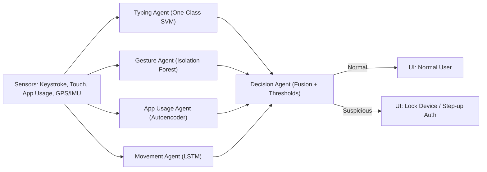

# System Design

## Architecture

Sensors → Local Agents → Decision Agent → Alert/Action

## Data Flow

1. Collect raw signals (or load CSVs). 2. Extract features. 3. Preprocess. 4. Per-agent scoring. 5. Fuse scores. 6. Trigger UI/action.

## Decision Fusion

- Normalize agent anomaly scores to [0,1].
- Weighted average or learned logistic regression.
- Thresholds tuned for target precision/recall.

## Security & Privacy

- On-device inference; no raw behavioral data leaves device.
- Model updates via secure channel or federated averaging (future work).

